## 1. Product Introduction

This project is a smart AI voice-interactive car based on the **ESP32-S3** main control chip. By integrating a high-sensitivity microphone module and a speaker, the car can recognize the user's voice commands and have real-time conversations or execute actions; combined with DC geared motors, a line-following sensor, and an ultrasonic obstacle-avoidance module, it is capable of autonomous movement.

*   **Main control**: Uses the ESP32-S3 dual-core processor, supports Wi-Fi and Bluetooth 5.0, with powerful computing capability and full support for AI voice processing libraries.
*   **AI voice interaction**: Built-in microphone and speaker, supports voice wake-up, voice recognition, and TTS (text-to-speech) broadcast, realizing a true "chat" function.
*   **Multi-mode motion**: Supports basic movements of forward, backward, turn left, and turn right, as well as advanced functions of automatic line following and intelligent obstacle avoidance.
*   **Graphical programming friendly**: Optimized for the KidsBlock graphical programming environment; no need to write complex code — drag and drop blocks to realize creative functions.
*   **Strong expandability**: Reserved GPIO interfaces for convenient future peripheral expansion.

> [Insert overall product image here: show a full view of the assembled Xiaozhi AI car]

---

### Kit List

| Module Name | Image | Quantity |
| :--: | :--: | :--: |
| Ultrasonic module |  | 1 |
| 5-channel line-following sensor |  | 1 |
| 180° servo | 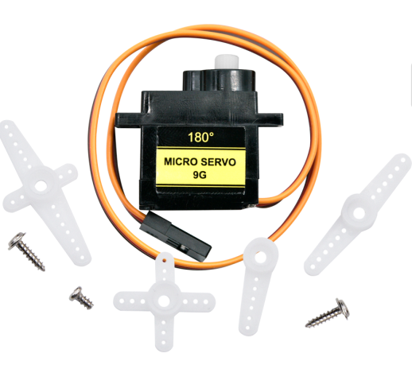 | 1 |
| Motor |  | 4 |
| Mecanum omnidirectional wheel A | 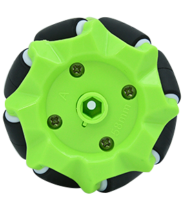 | 4 |
| Mecanum omnidirectional wheel B | 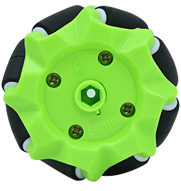 |  |
| Coupling |  | 4 |
| Blue shell | 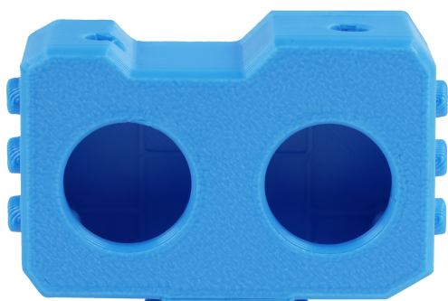 | 1 |
| Battery box | 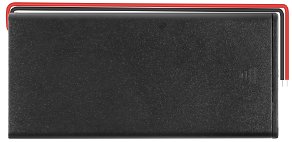 | 1 |
| Wood board |  | 2 |
| M2 nut | 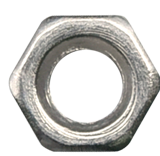 | 3 |
| M2*8mm round-head Phillips screw | 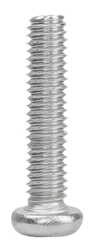 | 3 |
| M3*6mm flat-head Phillips screw | 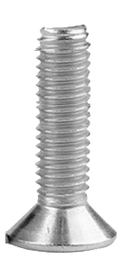 | 7 |
| M3*30mm round-head Phillips screw |  | 9 |
| M3 nut |  | 16 |
| M2.3*16mm round-head Phillips self-tapping screw | 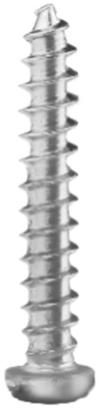 | 5 |
| M4*8mm round-head Phillips screw |  | 9 |
| M4*20mm double-pass hexagonal brass standoff | 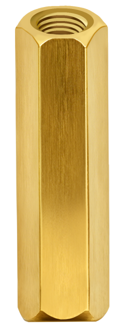 | 5 |
| 4P double-ended XH2.54 connector, L=200mm white connecting wire | 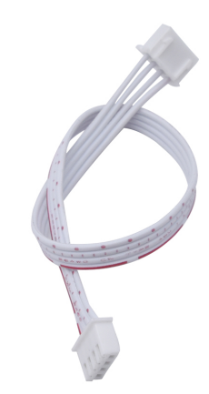 | 1 |
| 4P XH-2.54mm 22AWG 200mm black/red/blue/yellow wire |  | 1 |
