# 4. Project Tutorial

Code Download

 [code](code.7z) 

## 4.1 Car Driving

In this lesson, we will learn how to control the car's movement through code. Based on the ESP32 main control board, we will use the **Mecanum wheel** driving logic to make the car move forward, backward, turn left, and turn right.

> **Prerequisites**:
> 1. The assembled AI car hardware.
> 2. KidsBlock software installed.

### 4.1.1 How Mecanum Wheels Move

Unlike ordinary four-wheel cars, Mecanum wheels can achieve omnidirectional movement through different combinations of the direction and speed of the four wheels. In the code logic of this tutorial, we define the following movement modes:

- **Forward**: All four wheels turn forward at the same time.
- **Backward**: All four wheels turn backward at the same time.
- **Turn Left**: The right wheels turn forward and the left wheels turn backward (rotate in place).
- **Turn Right**: The left wheels turn forward and the right wheels turn backward (rotate in place).

### 4.1.2 Code Analysis

#### Motor Control Function

In the code, initialize the motor pins:

Control the direction and speed:

#### MCP Tool Invocation

This is the focus of this lesson. Instead of hard-coding "always forward", we let the **AI brain** decide how the car moves.

An MCP tool is registered in the code:

When the user says "forward" to the AI, the AI parses the intent and calls this tool, passing the action and speed.

#### OnMcpControl Callback Function

When the AI decides to control the car, the `OnMcpControl` function is triggered. We need to write the logic here to execute the corresponding action according to the command sent by the AI.

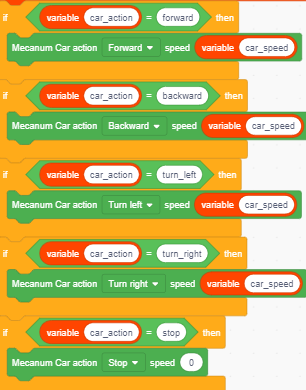

#### Detailed Logic

1. **Get command**: Extract action and speed from param.

2. **Judge action**:  

   If "forward": Car moves forward  

   If "backward": Car moves backward  

   If "turn_left": Car turns left  

   If "turn_right": Car turns right  

   If "strafe_left": Car strafes left  

   If "strafe_right": Car strafes right  

   If "diag_fw_left": Car moves diagonally forward-left  

   If "diag_fw_right": Car moves diagonally forward-right  

   If "diag_bw_left": Car moves diagonally backward-left  

   If "diag_bw_right": Car moves diagonally backward-right  

   If "stop": Car stops

3. **Execute drive**: The car runs with corresponding speed and action.

---

### 4.1.3 Car Testing

Now, we will test the car's movement functions through voice or debug tools.

#### Step 1: Flash the Code

Flash the code containing the above logic to the development board.

#### Step 2: Connect to the Network and Activate

Make sure the car connects to Wi-Fi and successfully connects to the AI server.

#### Step 3: Voice Control Test

After waking up the car with "Hello Xiaozhi", say the following commands to the car and observe its reactions:

| User Command | Underlying Logic | Behavior |
|---|---|---|
| "Car go forward" | action=forward: all four wheels rotate forward in the same direction | The car moves forward |
| "Car go backward" | action=backward: all four wheels rotate backward in the same direction | The car moves backward |
| "Turn left" | action=turn_left: left wheels reverse, right wheels forward | Rotate left in place |
| "Turn right" | action=turn_right: left wheels forward, right wheels reverse | Rotate right in place |
| "Strafe left" | action=strafe_left: mecanum wheels roll sideways | The car moves left sideways |
| "Strafe right" | action=strafe_right: mecanum wheels roll sideways | The car moves right sideways |
| "Move forward-left" | action=diag_fw_left: diagonal wheel drive | The car moves diagonally forward-left |
| "Move forward-right" | action=diag_fw_right: diagonal wheel drive | The car moves diagonally forward-right |
| "Move backward-left" | action=diag_bw_left: diagonal wheel drive | The car moves diagonally backward-left |
| "Move backward-right" | action=diag_bw_right: diagonal wheel drive | The car moves diagonally backward-right |
| "Stop" | action=stop: all four wheels' PWM set to 0 | The car stops |
| "Set speed to 150" | speed=150: wheel PWM adjusted to 150 | The car speed changes |

Tip: The speed can be adjusted in the range of 0-255.

## 4.2 Obstacle Avoidance Car

In this lesson, we will give the AI car "eyes" and a "brain", so that it can:

1. **Perceive the environment**: Use the ultrasonic sensor to detect obstacles ahead.
2. **Make decisions autonomously**: When an obstacle is found, automatically stop and observe the distances on the left and right.
3. **Avoid intelligently**: According to the width of the space on the left and right, automatically choose the best path to continue forward.

> **Prerequisites**:
> 1. The assembled AI car hardware (including the ultrasonic sensor and servo).
> 2. KidsBlock software installed.
> 3. Completed lesson 4.1 and mastered the basic driving methods of the car.

### 4.2.1 Core Obstacle Avoidance Logic Analysis

To achieve smooth obstacle avoidance, we cannot simply "stop when an obstacle is encountered"; instead, we need a complete **state machine logic**. We break the obstacle avoidance process into the following steps (corresponding to the `obsStep` variable in the code):

1. **Cruising state (Step 0)**: Move forward normally and monitor the distance ahead in real time.
2. **Obstacle detected (Step 1)**: When the distance is less than the threshold (e.g., 20cm), stop immediately and prepare to scan.
3. **Look left (Step 1-2)**: Control the servo to turn to the left side (180 degrees) and measure the left distance `distance_L`.
4. **Look right (Step 3-4)**: Control the servo to turn to the right side (0 degrees) and measure the right distance `distance_R`.
5. **Decision and turn (Step 5)**: Return the servo to center (90 degrees), compare `distance_L` and `distance_R`, and turn toward the wider side.
6. **Resume cruising (Step 6)**: After turning for a period of time, reset the state and return to Step 0 to continue forward.

### 4.2.2 Code Analysis

#### Initializing Variables and Pins

First, we need to define some global variables to record the car's state and sensor data.

- **Obstacle avoidance switch (`obstacle_enabled`)**: Determines whether the automatic obstacle avoidance mode is enabled.
- **State step (`obsStep`)**: Records which step of the obstacle avoidance process the car is currently in.
- **Distance variables**: Store the distance data of the front, left, and right.
- **Time recording**: Used for non-blocking delay control (to avoid the program freezing due to `delay`).

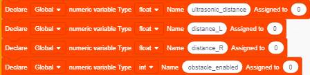

#### Configuring the MCP Tool (Let the AI Control Obstacle Avoidance)

To allow the voice assistant to turn the obstacle avoidance function on or off, we need to register an MCP tool.

- **Tool name**: `self.avoidance.set`

- **Parameters**: `state` (string: "on" or "off")
- **Execution logic**:
  - If "on" is received: set `obstacle_enabled = 1` and enter the manual servo mode for later scanning.
  - If "off" is received: set `obstacle_enabled = 0`, reset all states, and stop the car.

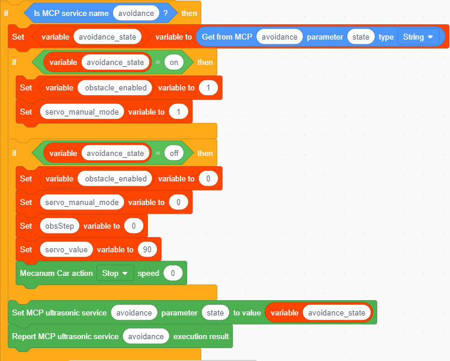

#### Writing the Obstacle Avoidance State Machine in the Main Loop

This is the core of this lesson. Write the following logic in the main loop or a dedicated obstacle avoidance logic function block. We use 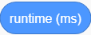 to get the current time and control the duration of actions by calculating the time difference (`elapsed`), instead of using blocking code blocks.

#### 1. Cruising Monitoring (Step 0)

When `obsStep == 0`:

- Read the ultrasonic front distance.
- **Judgment**: If the distance > 0 and < 20cm (obstacle present):
  - **Action**: Set all four wheels' PWM to 0 (stop).
  - **State**: `obsStep` changes to 1, record the current time as `lastActionTime`.
- **Otherwise** (no obstacle):
  - **Action**: All four wheels rotate forward, speed set to 150.

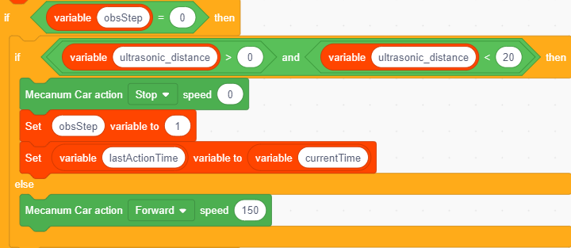

#### 2. Prepare to Scan Left (Step 1)

When `obsStep == 1`:

- **Judgment**: If `current time - lastActionTime > 500ms` (wait for the car to fully stop):
  - **Action**: Write the servo angle to 180 (look left).
  - **State**: `obsStep` changes to 2, update `lastActionTime`.

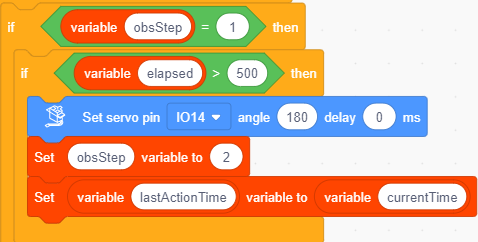

#### 3. Measure the Left Distance (Step 2)

When `obsStep == 2`:

- **Judgment**: If `current time - lastActionTime > 500ms` (wait for the servo to finish turning):
  - **Action**: Read the ultrasonic distance and assign it to `distance_L`.
  - **State**: `obsStep` changes to 3, update `lastActionTime`.

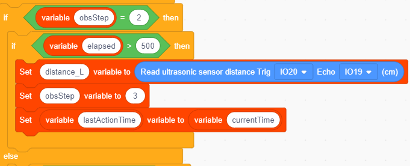

#### 4. Prepare to Scan Right (Step 3)

When `obsStep == 3`:

- **Judgment**: If `current time - lastActionTime > 500ms`:
  - **Action**: Write the servo angle to 0 (look right).
  - **State**: `obsStep` changes to 4, update `lastActionTime`.

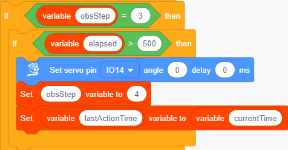

#### 5. Measure the Right Distance (Step 4)

When `obsStep == 4`:

- **Judgment**: If `current time - lastActionTime > 500ms`:
  - **Action**: Read the ultrasonic distance and assign it to `distance_R`.
  - **State**: `obsStep` changes to 5, update `lastActionTime`.

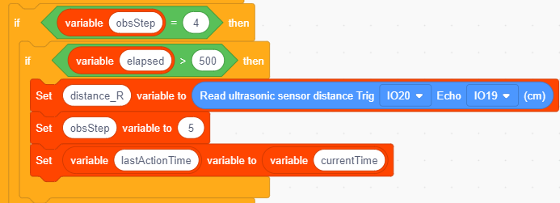

#### 6. Decision and Turn (Step 5)

When `obsStep == 5`:

- **Judgment**: If `current time - lastActionTime > 500ms`:
  - **Action 1**: Write the servo angle to 90 (return to center).
  - **Action 2 (core decision)**:
    - If `distance_L < distance_R` (the right side is wider): **turn right** (left wheels forward, right wheels reverse).
    - Otherwise (the left side is wider or equal): **turn left** (left wheels reverse, right wheels forward).
  - **State**: `obsStep` changes to 6, update `lastActionTime`.

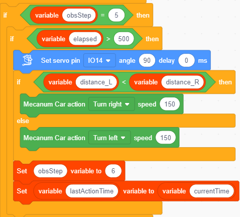

#### 7. Resume Cruising (Step 6)

When `obsStep == 6`:

- **Judgment**: If `current time - lastActionTime > 1000ms` (turning lasts for 1 second):
  - **State**: `obsStep` resets to 0, update `lastActionTime`.
  - Note: When the next loop enters Step 0, it will automatically start moving forward again.

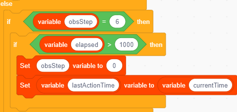

---

### 4.2.3 Car Testing

Now, we will test the car's movement functions through voice or debug tools.

#### Step 1: Flash the Code

Flash the code containing the above logic to the development board.

#### Step 2: Connect to the Network and Activate

Make sure the car connects to Wi-Fi and successfully connects to the AI server.

#### Step 3: Voice Control Test

After waking up the car with "Hello Xiaozhi", say the following commands to the car and observe its reactions:

| User Command | Underlying Logic | Behavior |
|---|---|---|
| "Car go forward" | action=forward: all four wheels rotate forward in the same direction | The car moves forward |
| "Car go backward" | action=backward: all four wheels rotate backward in the same direction | The car moves backward |
| "Turn left" | action=turn_left: left wheels reverse, right wheels forward | Rotate left in place |
| "Turn right" | action=turn_right: left wheels forward, right wheels reverse | Rotate right in place |
| "Strafe left" | action=strafe_left: mecanum wheels roll sideways | The car moves left sideways |
| "Strafe right" | action=strafe_right: mecanum wheels roll sideways | The car moves right sideways |
| "Move forward-left" | action=diag_fw_left: diagonal wheel drive | The car moves diagonally forward-left |
| "Move forward-right" | action=diag_fw_right: diagonal wheel drive | The car moves diagonally forward-right |
| "Move backward-left" | action=diag_bw_left: diagonal wheel drive | The car moves diagonally backward-left |
| "Move backward-right" | action=diag_bw_right: diagonal wheel drive | The car moves diagonally backward-right |
| "Stop" | action=stop: all four wheels' PWM set to 0 | The car stops |
| "Set speed to 150" | speed=150: wheel PWM adjusted to 150 | The car speed changes |
| "Turn on obstacle avoidance mode" | Obstacle avoidance enable set to 1, enter the obstacle avoidance state machine | Stops at obstacles, measures left and right distances, drives toward the wider direction |
| "Turn off obstacle avoidance mode" | Obstacle avoidance enable set to 0, reset state and stop | Stops obstacle avoidance |

Tips:

1. If the car does not execute the corresponding action, press the RESET button to restart and try again.
2. When obstacle avoidance mode is turned on, the speed cannot be changed by voice.

### 4.2.4 Summary of Key Knowledge Points

1. **Non-blocking programming**:
   - ❌ Wrong approach: using . This pauses the entire program (including the WiFi connection and voice listening) for 1 second, resulting in a poor experience.
   - ✅ Correct approach: use  to record a time point, and use `if (currentTime - lastTime > duration)` to judge whether the time has arrived. In this way, while waiting for the servo to turn or the ultrasonic sensor to measure distance, the background can still process network data and voice commands.
2. **State machine**:
   - Use the `obsStep` variable to break the complex obstacle avoidance action into small steps. Each step only does one simple action (such as "turn head", "measure distance", "compare"), making the logic clear and easy to debug.
3. **Ultrasonic ranging principle**:
   - Send a trigger signal (Trig High 10us) → receive the echo signal (Echo) → calculate the duration of the high level → convert it to distance (`duration * 0.034 / 2`).

## 4.3 Line-Following Car

In this lesson, we will give the car "eyes" and a "brain", so that it can recognize the black line on the ground and automatically follow the path. You will learn:

1. **Sensor principle**: Understand how the five-channel infrared line-following sensor works.
2. **Motion control**: Combine the characteristics of Mecanum wheels to achieve smooth correction movements.
3. **AI interaction**: Turn the line-following mode on or off through voice commands.

> **Prerequisites**:
> 1. The assembled AI car hardware (including the five-channel infrared line-following sensor).
> 2. KidsBlock software installed.
> 3. Completed lesson 4.1 and mastered the basic driving methods of the car.

### 4.3.1 Core Line-Following Logic Analysis

The core idea of line following is: **"Detect deviation → correct direction"**.

Our sensor has 5 probes (numbered L2, L1, C, R1, R2 from left to right).

- **White ground**: High reflectivity, the sensor returns `1`.
- **Black line**: Absorbs light, the sensor returns `0`.

### 4.3.2 Code Analysis

#### Initialization and Variable Settings

Initialize the line-following module:

Define the line-following state variables:

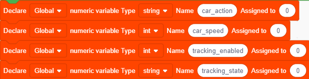

#### Registering the MCP Tool (Let the AI Control Line Following)

We need to let the AI know how to control the line-following switch. In the code, we have defined the `self.line_track.set` tool.

In the graphical interface, make sure the following event listener is registered:

- When an MCP call to `self.line_track.set` is received:
  - Get the parameter `state`.
  - If `state` is "on", set the `line following enable` variable to 1.
  - If `state` is "off", set the `line following enable` variable to 0 and call `stop`.

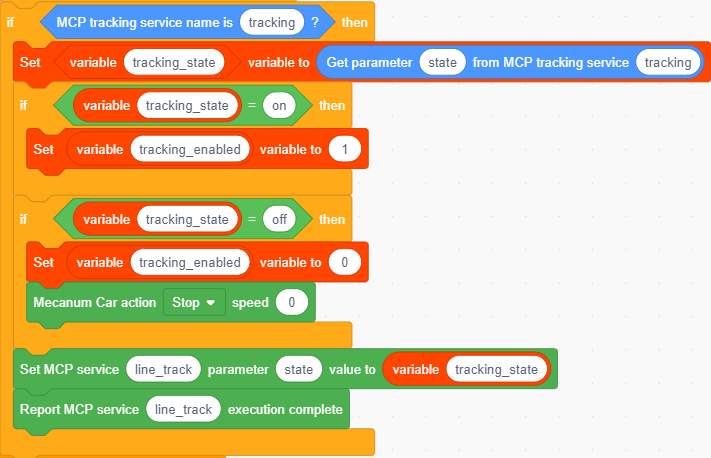

#### Defining the Line-Following Behavior Function

#### 1. Basic State Judgment

We need to keep reading the sensor values. The ideal state is that the **middle probe (C)** detects the black line while the other probes detect white ground. At this time, the car should **move straight forward**.

#### 2. Slight Deviation Correction

If the car deviates slightly to the left, the **right inner probe (R1)** will press on the black line; if it deviates slightly to the right, the **left inner probe (L1)** will press on the black line.

- **When deviating left**: We need to turn right a little. For Mecanum wheels, a small right turn can be achieved by accelerating the right wheels or decelerating/reversing the left wheels.
- **When deviating right**: We need to turn left a little.

#### 3. Severe Deviation Correction

If the car deviates greatly, the **outer probes (L2 or R2)** will detect the black line. At this time, a larger turn is needed.

- **Severely left (L2 detects the black line)**: Execute a large right turn.
- **Severely right (R2 detects the black line)**: Execute a large left turn.
- **Line completely lost**: If all probes see white, or only the edge probes flicker occasionally, for safety the car should **stop** and wait for the next command or search for the line again.

---

### 4.3.3 Car Testing

Now, we will test the car's movement functions through voice or debug tools.

#### Step 1: Flash the Code

Flash the code containing the above logic to the development board.

#### Step 2: Connect to the Network and Activate

Make sure the car connects to Wi-Fi and successfully connects to the AI server.

#### Step 3: Voice Control Test

After waking up the car with "Hello Xiaozhi", say the following commands to the car and observe its reactions:

| User Command | Underlying Logic | Behavior |
|---|---|---|
| "Car go forward" | action=forward: all four wheels rotate forward in the same direction | The car moves forward |
| "Car go backward" | action=backward: all four wheels rotate backward in the same direction | The car moves backward |
| "Turn left" | action=turn_left: left wheels reverse, right wheels forward | Rotate left in place |
| "Turn right" | action=turn_right: left wheels forward, right wheels reverse | Rotate right in place |
| "Strafe left" | action=strafe_left: mecanum wheels roll sideways | The car moves left sideways |
| "Strafe right" | action=strafe_right: mecanum wheels roll sideways | The car moves right sideways |
| "Move forward-left" | action=diag_fw_left: diagonal wheel drive | The car moves diagonally forward-left |
| "Move forward-right" | action=diag_fw_right: diagonal wheel drive | The car moves diagonally forward-right |
| "Move backward-left" | action=diag_bw_left: diagonal wheel drive | The car moves diagonally backward-left |
| "Move backward-right" | action=diag_bw_right: diagonal wheel drive | The car moves diagonally backward-right |
| "Stop" | action=stop: all four wheels' PWM set to 0 | The car stops |
| "Set speed to 150" | speed=150: wheel PWM adjusted to 150 | The car speed changes |
| "Turn on line-following mode" | Line following enable set to 1, enter the line-following logic | The car automatically follows the line on the black-line track |
| "Turn off line-following mode" | Line following enable set to 0, and stop | Stops line following |

Tips:

1. If the car does not execute the corresponding action, press the RESET button to restart and try again.
2. When line-following mode is turned on, the speed cannot be changed by voice.

**Speed adjustment**: If you find that the car often runs off the track, try lowering the speed values in  and the speed values used when turning left and right.

## 4.4 Comprehensive Practice: Full Integration of All AI Car Functions

In the previous three lessons, we implemented the car's **driving control**, **automatic obstacle avoidance**, and **automatic line following** separately. In this lesson, we will integrate these three functions into the same program, making the car a complete intelligent agent that can "listen, see, and move". You will learn:

- **Top-level mode management**: Use a state variable to manage the car's running mode (manual / obstacle avoidance / line following);
- **Modular integration**: Organize the logic blocks from the previous lessons into the same main loop without interfering with each other;
- **Conflict handling**: Multiple automatic modes cannot take effect at the same time; priority rules need to be designed;
- **Complete testing process**: Verify the integrated car through scenario-based steps.

> **Prerequisites**:
> 1. Completed lessons 4.1, 4.2, and 4.3; the car's driving, obstacle avoidance, and line following have all been debugged and passed.
> 2. KidsBlock software installed.

### 4.4.1 Overall System Architecture

The integrated car is divided into four layers overall:

| Layer | Module | Function |
|---|---|---|
| Perception layer | Ultrasonic sensor | Detects the obstacle distance ahead, used in obstacle avoidance mode |
| Perception layer | Five-channel infrared line-following sensor | Detects the black line on the ground and judges whether the car has deviated from the route |
| Decision layer | AI brain (voice + MCP) | Understands voice commands and calls MCP tools to control mode switches |
| Decision layer | Local mode management | Distributes the main loop logic according to mode variables and handles mode mutual exclusion |
| Execution layer | Mecanum wheel motors | Execute forward, backward, turning, and stopping |
| Execution layer | Servo | Drives the ultrasonic sensor to scan left and right |

Core design ideas:

1. **One main loop, multiple logic blocks**: All functions share the same loop, using time differences for non-blocking control (review the knowledge point in 4.2);
2. **Mode variables determine behavior**: The two switches `obstacle avoidance enable` and `line following enable` together determine which logic the car currently executes;
3. **The AI only "issues intent"**: Mode switching and action execution are all completed by local logic; the AI brain does not directly control the motors.

### 4.4.2 Mode Management and Priority Rules

#### 1. Three Running Modes

| Mode | Trigger Condition | Car Behavior |
|---|---|---|
| Manual mode | obstacle avoidance enable = 0 and line following enable = 0 | Responds to "forward" / "backward" / "turn left" / "turn right" / "stop" / "speed adjustment" |
| Obstacle avoidance mode | obstacle avoidance enable = 1 | Automatic cruising and obstacle avoidance (state machine in 4.2), ignores manual direction commands |
| Line-following mode | line following enable = 1 | Automatically follows the black line (correction logic in 4.3), ignores manual direction commands |

#### 2. Mode Mutual Exclusion Rules (New Knowledge Point in This Lesson)

Obstacle avoidance and line following are both "autonomous driving". If both are enabled at the same time, the two logic blocks will compete for motor control at the same time, and the car's behavior will be unpredictable. Therefore, two rules are established:

**Rule 1 (mutual exclusion)**: When obstacle avoidance mode is turned on, line-following mode is automatically turned off; when line-following mode is turned on, obstacle avoidance mode is automatically turned off. The mode turned on later overrides the one turned on earlier.

**Rule 2 (manual mode is the default)**: After any automatic mode is turned off, the car automatically returns to manual mode and waits for commands.

### 4.4.3 Code Analysis

#### 1. Global Variable Initialization

The integrated program needs to manage the state variables of two sets of autonomous driving logic at the same time: `obstacle avoidance enable`, `line following enable`, the obstacle avoidance state machine variable `obsStep`, ultrasonic distance variables (front / left / right), line-following sensor values (L2, L1, C, R1, R2), and `lastActionTime` for non-blocking delays.

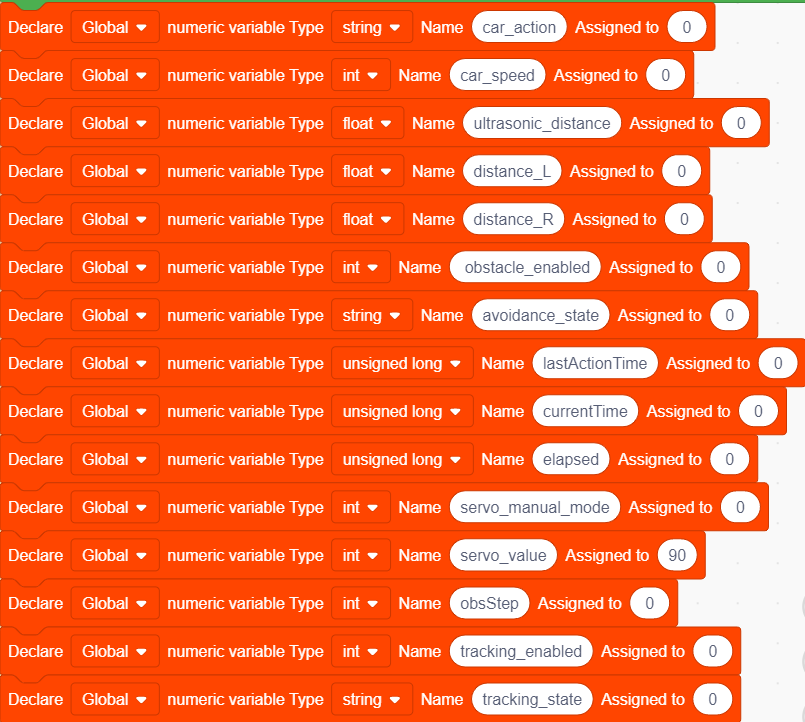

#### 2. MCP Tool Callback: The Entry Point for Mode Switching

Keep the tools registered in 4.2 and 4.3 unchanged (`self.avoidance.set` and `self.line_track.set`), and only add **mutual exclusion handling** to the callback logic:

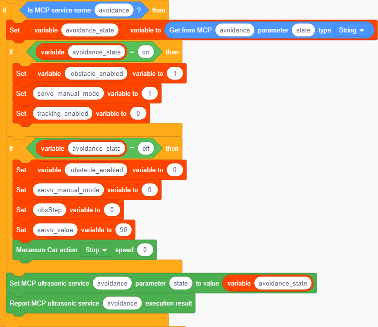

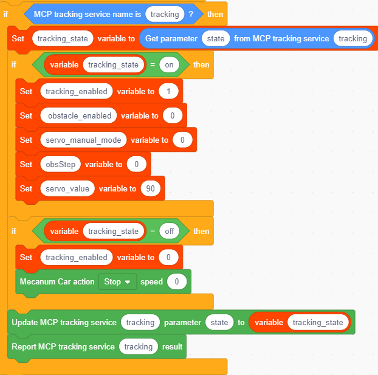

- Turn on obstacle avoidance (state is "on"): set `obstacle avoidance enable` to 1, and `line following enable` to 0 at the same time (mutual exclusion: automatically turn off line following);
- Turn off obstacle avoidance (state is "off"): set `obstacle avoidance enable` to 0, reset the `obsStep` state machine, and stop;
- Turn on line following (state is "on"): set `line following enable` to 1, and `obstacle avoidance enable` to 0 at the same time (mutual exclusion: automatically turn off obstacle avoidance);
- Turn off line following (state is "off"): set `line following enable` to 0 and stop.

#### 3. Main Loop Mode Dispatch

The main loop is the core of the integrated program. Each loop judges the current mode by priority and dispatches it to the corresponding logic block: when `obstacle avoidance enable` is 1, execute the obstacle avoidance state machine (the obsStep logic in 4.2); otherwise, when `line following enable` is 1, execute the line-following correction logic (the sensor judgment logic in 4.3); otherwise, wait for AI manual commands (the motor control logic in 4.1).

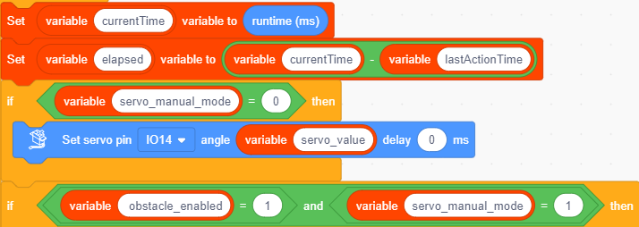

All three logic blocks use the non-blocking method `currentTime - lastActionTime > duration` to control timing, so no matter which mode the car is in, the Wi-Fi connection and voice listening remain unobstructed.

---

### 4.4.4 Car Testing

#### Step 1: Flash the Code

Flash the integrated code to the development board.

#### Step 2: Connect to the Network and Activate

Make sure the car connects to Wi-Fi and successfully connects to the AI server.

#### Step 3: Voice Control Test

**Test A: Manual Control (Review of 4.1)**

| User Command | Underlying Logic | Behavior |
|---|---|---|
| "Car go forward" | action=forward: all four wheels rotate forward in the same direction | The car moves forward |
| "Car go backward" | action=backward: all four wheels rotate backward in the same direction | The car moves backward |
| "Turn left" | action=turn_left: left wheels reverse, right wheels forward | Rotate left in place |
| "Turn right" | action=turn_right: left wheels forward, right wheels reverse | Rotate right in place |
| "Strafe left" | action=strafe_left: mecanum wheels roll sideways | The car moves left sideways |
| "Strafe right" | action=strafe_right: mecanum wheels roll sideways | The car moves right sideways |
| "Move forward-left" | action=diag_fw_left: diagonal wheel drive | The car moves diagonally forward-left |
| "Move forward-right" | action=diag_fw_right: diagonal wheel drive | The car moves diagonally forward-right |
| "Move backward-left" | action=diag_bw_left: diagonal wheel drive | The car moves diagonally backward-left |
| "Move backward-right" | action=diag_bw_right: diagonal wheel drive | The car moves diagonally backward-right |
| "Stop" | action=stop: all four wheels' PWM set to 0 | The car stops |
| "Set speed to 150" | speed=150: wheel PWM adjusted to 150 | The car speed changes |

Tip: The speed can be adjusted in the range of 0-255.

**Test B: Mode Switching and Mutual Exclusion**

| User Command | Underlying Logic | Behavior |
|---|---|---|
| "Turn on obstacle avoidance mode" | obstacle avoidance enable = 1, line following enable = 0 | Stops at obstacles, measures left and right distances, drives toward the wider direction |
| "Turn on line-following mode" | line following enable = 1, obstacle avoidance enable = 0 | Automatically follows the line (obstacle avoidance automatically turns off) |
| "Turn off line-following mode" | line following enable = 0, stop | Stops line following |
| "Turn on obstacle avoidance mode" (while line following) | The later-enabled obstacle avoidance overrides line following | Switches to obstacle avoidance behavior |
| "Turn off obstacle avoidance mode" | obstacle avoidance enable = 0, stop | Returns to manual mode |

Tip: If the car does not execute the corresponding action, press the RESET button to restart and try again.

### 4.4.5 Summary of Key Knowledge Points

**1. Top-level state machine and sub-state machine**

- The `obsStep` inside obstacle avoidance mode is a **sub-state machine**, responsible for breaking complex actions into small steps;
- The mode variables (`obstacle avoidance enable` / `line following enable`) are the **top-level state machine**, determining which logic the car currently executes;
- The nesting of two layers of state machines is the most common way to organize robot programs.

**2. Mode mutual exclusion and priority**

- Multiple autonomous driving logic blocks cannot occupy motor control at the same time; clear mutual exclusion rules are required;
- "The later-enabled overrides the earlier-enabled" and "turning off an automatic mode returns to manual mode" are simple and reliable default strategies.

**3. Reset the state before switching modes**

- When turning off obstacle avoidance mode, first reset `obsStep` and stop, to avoid residual actions from the previous mode affecting the next activation;
- Before each mode switch, make sure the car is in a stopped state, then enter the new mode's logic.

**4. Reuse of non-blocking programming**

- The `currentTime - lastActionTime > duration` approach learned in 4.2 is used throughout the integrated program;
- No matter what mode the car is in, the Wi-Fi connection and voice listening must not be blocked by `delay`.

**5. Modular division of labor**

- The AI brain is only responsible for understanding voice intent and calling tools; it does not directly control the motors;
- The local program is responsible for all safety logic, mutual exclusion rules, and actual execution. In the future, to add new functions, you only need to add a new mode switch and its corresponding logic block.
